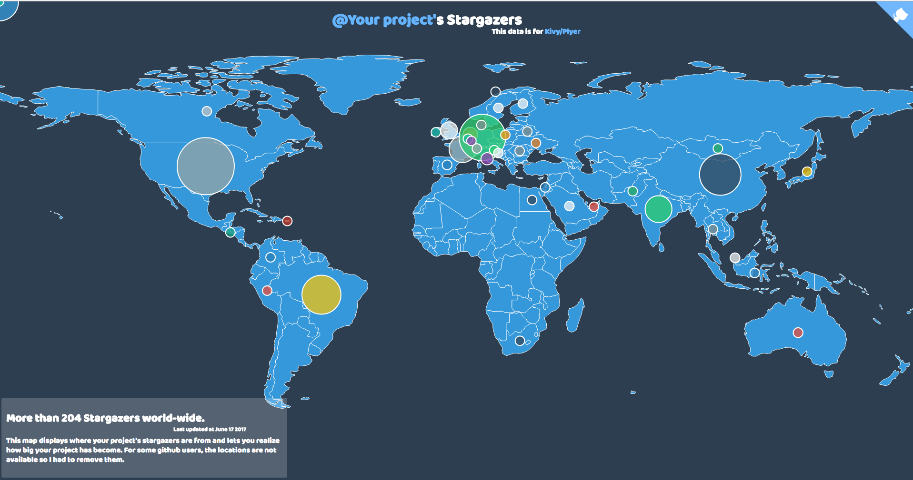

# Track-Your-Stargazers
Have fun tracking your project's stargazers.




## Inspiration

I saw [this](https://www.codementor.io/johnnyb/the-map-of-my-mentees-7q7aqrktp) post at Codementor by [Ionică Bizău](https://github.com/IonicaBizau) which lead me to his [project](https://github.com/IonicaBizau/my-mentees), so I decided to create something cool of my own.

## What have I used?

**Python**
  - [BeautifulSoup](https://www.crummy.com/software/BeautifulSoup/bs4/doc/) & [GitHub's API](https://developer.github.com/v3/users/) to get user data.
  - [Geopy](https://geopy.readthedocs.io/) to get country from location.

**Javascript**
  - [Datamaps](http://datamaps.github.io/) and [d3.js](https://d3js.org/) to build the map.


## See the World Map showing your project's stargazers in just 2 Steps.

  - **Step 1**

    Run the following command replacing the url with your own. 
    Please, use Python <= 3.9, because some libraries are incompatible with newer versions.
    ```
    python3 main.py https://github.com/kivy/plyer 3 1 0
    ```
    Arguments:
    
      - **url**: URL of the project/ Repo who's stargazers you want to track.
      e.g: `http://github.com/kivy/plyer`

      - **number_of_threads** (+ve integer): Number of python threads you want to run. It will divide the entire users list into smaller lists equal to `number_of_threads` and create a new thread for each.
      
        ```
        python3 main.py http://github.com/kivy/plyer 3
        ```
        
        example:
        ```
        l = [1, 2, 3, 4, 5, 6, 7, 8, 9, 10]
        print (chunk_stargazers(l, 3))
        print (chunk_stargazers(l, 2))
        ```
        output
        ```
        [[1, 2, 3], [4, 5, 6], [7, 8, 9, 10]]
        [[1, 2, 3, 4, 5], [6, 7, 8, 9, 10]]
        ```
    While parallel CPU computation is not possible, parallel IO operations are possible using threads in Python. This is because performing IO operations releases the GIL. In network IO, most of the time is spent waiting for the response from the URL, so this is a use case where using threads improves performance, so why not use them? :D

      - **use_api** (Binary): Choose whether you want to use the GitHub's user API to get the user data or use the scraper. To use the api enter `1` else `0`
      ```
      python3 main.py http://github.com/kivy/plyer 3 1
      ```
      
      - **read_from_stargazers_json** (Binary): If there is a `stargazers.json` file aleady present with list of users you want to plot then you can skip scraping of users from the project's stargazer's page e.g `http://github.com/kivy/plyer/stargazers?page=2` by setting the value of this argument to 1.
      ```
      python3 main.py http://github.com/kivy/plyer 3 1 0
      ```

  - **Step 2**

    `python3 merge_data.py 2`

    Arguments:

      - **number_of_files**: Let this number be equal to `number_of_threads` since each thread create a new `json` file.
      ```
      jsons/
          data_0.json
          data_1.json
      ```
      
      so the command should be
      
      `python3 merge_data.py 2`
      
      This command will merge all the `json` files and generate a new `stargazers.js` in the `data/` directory. `stargazers.js` file will later be used as data source when plotting the map.

Open the Browser with `index.html` and get surprised.

## Want to contribute or need to see some improvements?
I would love that, please create an issue or send a PR.

